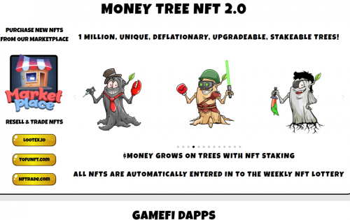
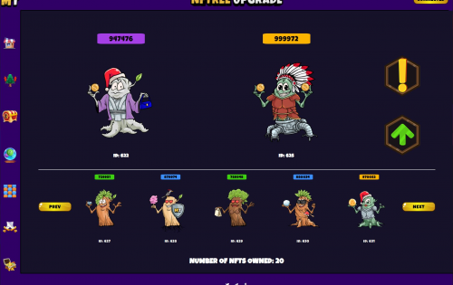
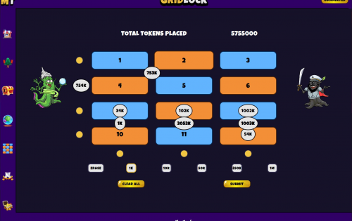

# MoneyTree

Money Tree 平台托管了一系列 100% 在链上运行的 dApp，这些 dApp 建立在统计公平的基础上，没有房子优势，所有结果都是使用 Chainlink VRF 选择的。$MONEY 用作与小游戏互动的基础货币。$MONEY 的持有者可以从交易税中获得每周 $BNB 和 $MONEY 代币红利，并从战利品盒和 NFT 销售中获得共享收入。$MONEY 持有者也会自动参加以 BUSD 支付的免费每周彩票。持有的 $MONEY 越多，获胜的几率就越大，红利也越大。

有 100 万个独特的通缩货币树 NFT 可以被烧毁、升级或质押。升级 NFT 会烧掉两棵金钱树，并随机返回一棵稀有度更高的新金钱树。可以种植 Money Tree NFT 以通过质押 dApp“增长”$MONEY 代币。所有 Money Tree NFT 都会自动进入每周抽奖，所有者有机会赢得更多 NFT。

