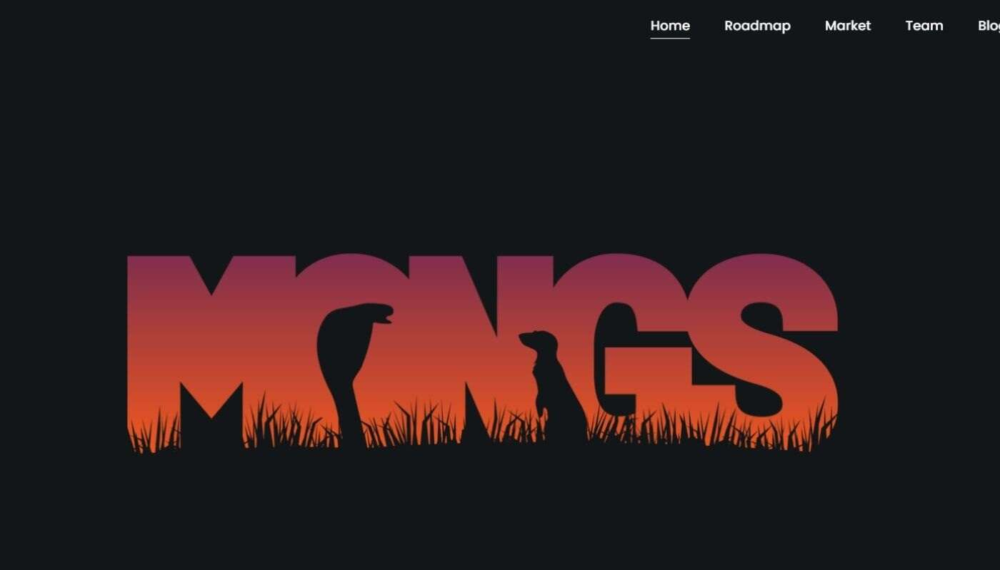

# MONGS NFT

MONGS是一种文化，一种氛围。他们认为这在某种程度上是新的、时髦的，是对社会权力的攻击。

6969 个生成的 MONGS 将来到以太坊。他们计划取代加密货币。

MONGS NFT NFT 在过去 7 天内售出 6 次。MONGS NFT 的总销售额为 338.12 美元。一个 MONGS NFT NFT 的平均价格为 56.4 美元。有 1,603 名 MONGS NFT 

所有者，拥有 6,969 个代币的总供应量。

METACOLLECT 画廊于 2022 年 6 月 11 日向公众开放。我们很自豪能够通过提供澳大利亚首个永久性 NFT 画廊和 Web3 活动空间来支持 Web3 运动。

UNDRGRND 于 2021 年 11 月推出，是一个与链无关的 NFT 艺术出版物，将与 METACOLLECT 画廊携手合作。

NFTJoe领导着才华横溢的作家团队，他们筛选社交媒体和 NFT 平台，寻找等待被发现的最佳艺术家。在此处阅读发布文章。

UNDRGRND Marketplace 将于 2022 年第三季度推出，将成为一个多链 NFT 艺术市场，专注于通过直观的用户界面提供高速交易、低费用的体验。

我们相信非 Web3 本地艺术家应该能够轻松地铸造他们的 NFT 作品，而无需阅读文档页面来弄清楚这个过程。

它也将是第一个真正游戏化的 NFT 市场，使用我们的 $COLLECT 代币来管理默认视图提要。
