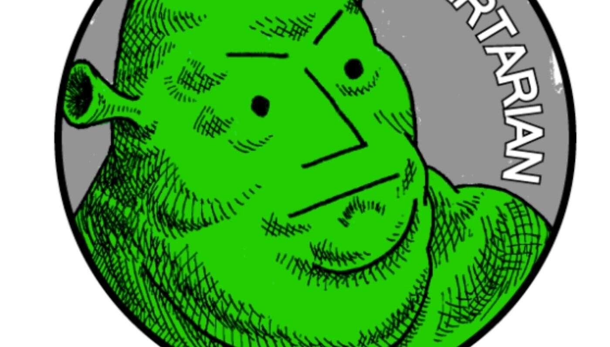

# moninfunsun

**什么是moninfunsun？**

moninfunsun 是一个 NFT（非同质代币）集合。存储在区块链上的数字艺术品集合。

**有多少个 moninfusun 代币？**

总共有 1 个 moninfunsun NFT。目前 1 位所有者的钱包中至少有一个 moninfunsun NTF。

**最近卖了多少个moninfunsun？**

过去 30 天共售出 0 个 moninfunsun NFT。

欢迎来到 OpenSea 上的 moninfunsun 之家。发现这个系列中最好的项目。创建于 11 个月前1 代币供应，10% 费用拥有者，业主数量1个。moninfunsun 与 创 

意世界将带着全球前瞻性的流行趋势，为您发掘更多的可能性。
