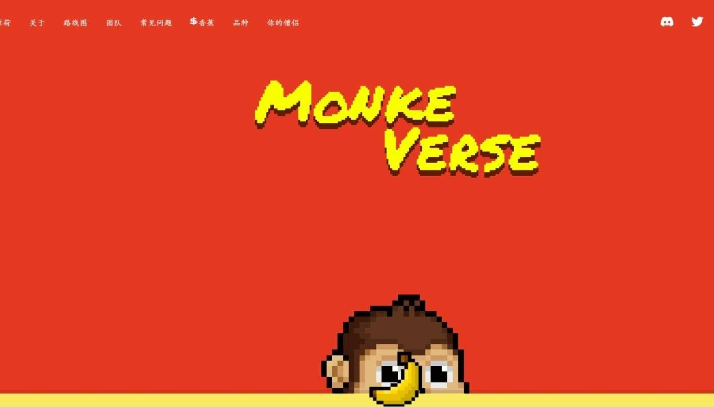

# MonkeVerse

MonkeVerse NFT 在过去 7 天内售出 14 次。MonkeVerse 的总销售额为 139.42 美元。MonkeVerse NFT 的平均价格为 10 美元。共有 1,531 名 MonkeVerse 所

有者，总共拥有 3,333 个代币。

您持有的每个#monke 每天都会生成 10 个 $banan 代币。

MonkeVerse 是 3,333 名僧侣的集合，在区块链等以太坊“丛林”中绝对疯狂。

随着夜幕降临，月亮开始在夜空中闪耀，奇怪的黄色物体开始从奇怪的树上长出。蒙克抬头看着那棵树，想知道这些长出的东西是什么。他爬上最近的一棵树，开

始盯着这棵奇异树最低的树枝。黄色的物体是弯曲的，在月光下发出柔和的光芒。僧侣伸出手臂，伸手去拿那个物体——MonkeVerse 就这样开始了

丛林中住着古代僧侣。只剩下 13 个，每个都有自己独特的 1/1 动画。 随着我们进一步开发 MonkeVerse，这些古代僧侣的

您持有的每个#monke 每天都会生成 10 个 $banan 代币。用 600 $banan 持有两只僧侣，您可以通过繁殖选项卡培育出独特的小僧侣。

MonkeVerse 团队继续为我们的持有者寻找高质量的白名单，我们已经签署了 NDA 以进行大型合作以扩大营销和开发一种即玩即赚 (P2E) 游戏，这将显着增加婴

儿僧侣、$banan 和 gensis 的价值僧侣！

Metaverse 实施 - Arcade Land 将成为僧侣的首选目的地；一旦那里的持有者将拥有僧侣体素，将在那里举行颁奖晚会+活动。我们拥有一块 X 大的地块。
