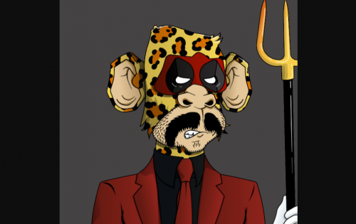
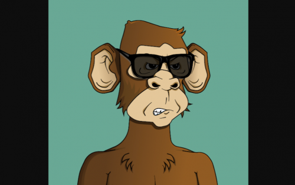

# Monkey Bet DAO

Monkey Bet 是世界上第一个去中心化游戏 x NFT 协议。每个 Monkey 都是 DAO 成员。猴子的最大供应量为 10,000 个，每个铸币成本为 0.05 ETH。Monkey miners 收到 Monkey Money，这是 Monkey Bet 赌场的本地货币。第一款老虎机游戏现已上线。立即使用 Monkey Money 代币进行游戏。Monkey Money 是一种 ERC-20 代币，每个 NFT 铸币您都会收到 25,000 个代币。很快，您将能够为每只猴子质押 25,000 多个代币。Monkey Bet 的独特之处在于，Monkeys 具有影响游戏玩法的实际效用。在赌场获胜的机会受特质分数的影响。在 Monkey Bet，猴子们经营着动物园。所有 Monkey Bet 游戏收入都归于 Monkey DAO。1 个 Monkey = 1 个 Monkey DAO 投票。

Invariant LABS 不拥有任何猴子，不是 MONKEY DAO 的成员，也不会从赌场运营中收到任何猴子钱。MONKEY MONEY (MM) 是游戏中的信用代币，没有任何价值。赌场游戏仅用于娱乐目的。Invariant LABS 不为 MM 代币提供任何流动性或支持任何市场。MONKEY NFTS 是一种社区治理代币，没有价值，不构成投资。

