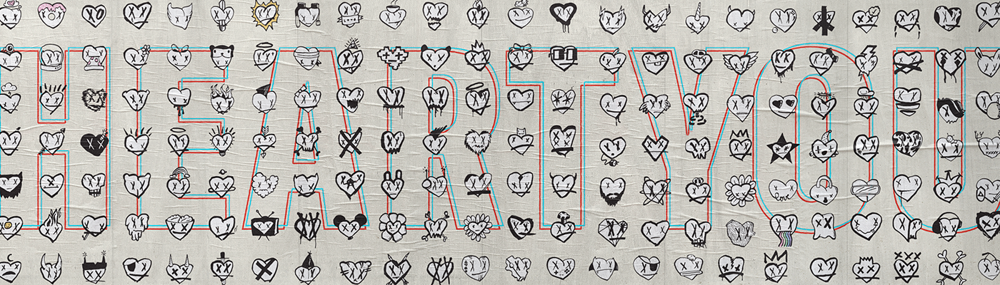

# Monochrome by Heart You

Monochrome 由 Heart You 创建，是与 Moonbirds 合作的 1:1 手绘集合。 照原样看待事物，让一切顺其自然。

Monochrome by Heart You NFT - 常见问题（FAQ）
▶ 什么是 Heart You 的 Monochrome？
Monochrome by Heart You 是一个 NFT（不可替代代币）系列。存储在区块链上的数字艺术品集合。
▶ 有多少 Monochrome by Heart You 代币？
Heart You NFT 共有 179 个 Monochrome。目前，167 位车主的钱包中至少有一个 Monochrome by Heart You NTF。
▶ Heart You 出售的最昂贵的 Monochrome 是什么？
Heart You NFT 出售的最昂贵的 Monochrome 是 Monochrome #140。它于 2022 年 6 月 30 日（大约 2 个月前）以 190 美元的价格售出。
▶ 最近卖出了多少 Monochrome by Heart？
过去 30 天内售出了 14 个 Monochrome by Heart You NFT。
▶ 用心制作的 Monochrome You 多少钱？
过去 30 天，最便宜的 Monochrome by Heart You NFT 销售额低于 364 美元，最高销售额超过 1477 美元。 Heart You NFT 的 Monochrome 在过去 30 天内的中位价格为 556 美元。
▶ 有哪些流行的 Monochrome by Heart You 替代品？
许多拥有 Monochrome by Heart You NFT 的用户还拥有 tinymfers、Yokeipto、Tigerbob NFT Concepts & Myths 和 Heart You 的 Emotes。
 交互式 NFT 项目：Goofball Gang。立即购买。

