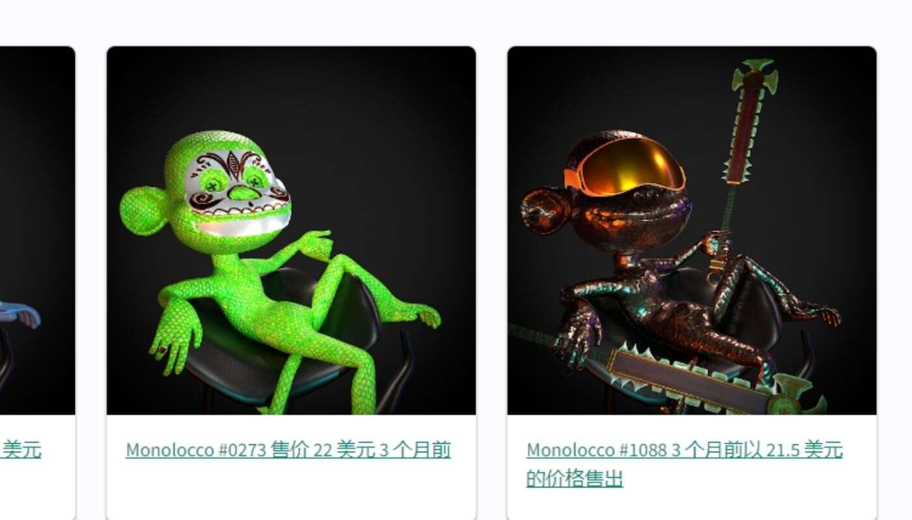

# MonoLocco XYZ

Monolocco 是一个 NFT 生成的 monos 集合，具有一百多个独特元素，灵感来自玛雅文化和欧洲高级时装业的混合

Dolce & Gabbana、Dior 和 Burberry 造型师以及才华横溢的 3D 艺术家联手打造每一个元素。

每个 NFT 都授予您访问 LOCCO ALPHA 的权限

总共有 1,571 个 MonoLocco Genesis NFT。目前，947 位车主的钱包中至少有一个 MonoLocco Genesis NTF。

售出的最昂贵的 MonoLocco Genesis NFT 是 Monolocco #0287。它于 2022-06-17（3 个月前）以 26.3 美元的价格售出。

过去 30 天内售出了 7 个 MonoLocco Genesis NFT。
