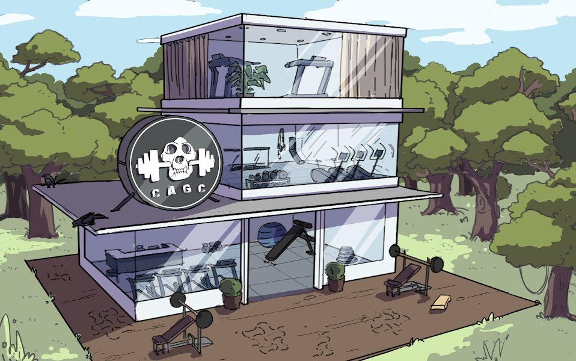

# Monster Ape Gym Club

在不久的将来，作为实验的一部分——以太坊区块链上的 10,000 只猿被暴露在超级猿血清中，将它们变形为 6969 只具有超级猿能力的 CHAD 猿。剩下的 3031 只猿对超级猿有不良反应 血清将他们变成了恶毒的怪物。 这些怪物猿现在正在以太坊区块链中游荡，因此如果没有在解毒剂的帮助下被捕获和治愈，就会威胁到以太坊区块链的存在。

什么是 Monster Ape 健身俱乐部？
Monster Ape Gym Club 是一个 NFT（Non-fungible token）集合。 存储在区块链上的数字艺术品集合。
▶ Monster Ape Gym Club 代币有多少？
总共有 2,924 个 Monster Ape Gym Club NFT。 目前，365 位所有者的钱包中至少有一个 Monster Ape Gym Club NTF。
▶ 最近卖了多少魔猿健身俱乐部？
过去 30 天内共售出 0 个 Monster Ape Gym Club NFT。
▶ 什么是流行的 Monster Ape Gym Club 替代品？
许多拥有 Monster Ape Gym Club NFT 的用户还拥有 Chad Ape Gym Club、HatBeardMan、ThisABear 和 You Are My Hero 官方。

