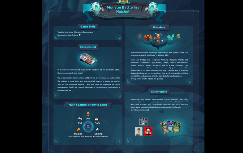
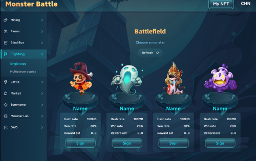
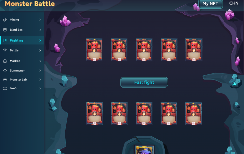

# Monster Battle

Monster Battle 是一个受炉石传说启发的 TCG 风格 GameFi项目，

旨在为用户提供既令人兴奋的游戏体验（通过

继承了《炉石传说》游戏中微妙而复杂的复杂性

机制）和通过他们的游戏才能获利的方法和

技巧。

除了 GameFi，我们还致力于构建其他密钥

技术基础设施的组成部分对于实现

真正的元宇宙，包括DAO和Def i。我们将通过

内部开发以及其他项目的孵化

利用我们的孵化平台“怪物实验室”。

