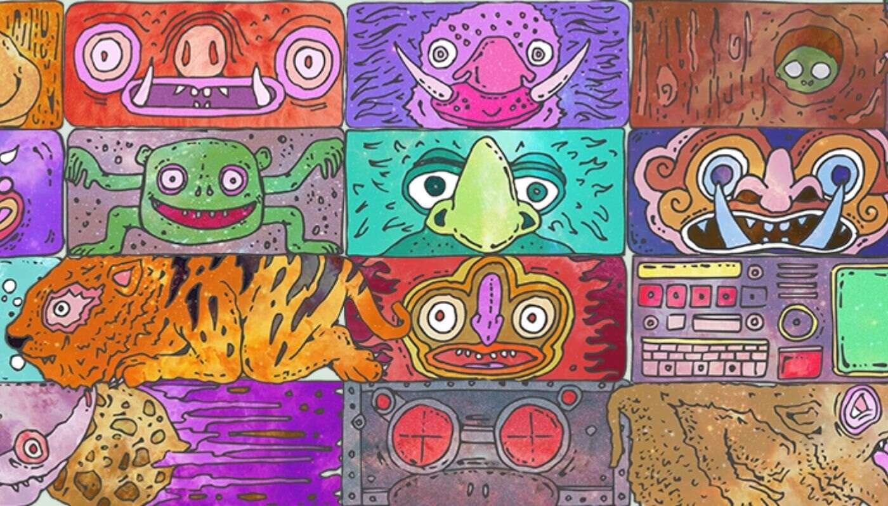

# Monster Blocks - Official

Monster Blocks - 官方 NFT 在过去 7 天内售出 4 次。Monster Blocks - Official 的总销量为 $86.32。一个 Monster Blocks - Official NFT 的平均价格为 21.6 美

元。共有 1,986 个 Monster Blocks - 官方所有者，总共拥有 8,873 个代币。

Monster Blocks 是由巨大的积木构成的光彩夺目的塔楼，竖立在区块链上。使用我们专有的堆叠技术，Stackinator，Monster Blocks 可以合并和堆叠，以创建新

的、宏伟的塔，让所有的虚拟世界欣赏和羡慕。最多存在 10,000 个怪物块。

每个怪物块都是由较小的块“属性”构成的，正如您现在所期望的那样，它们的形状和颜色、稀有度和阴谋各不相同。

每个属性都是手绘、手绘、手工输入牛津数学家开发的极其复杂的算法，以确保每个怪物块都是可堆叠的、独一无二的，并且在 ETH 中物有所值。

我们的智能合约不是复制粘贴工作；它是手工制作的。我们已与Chainlink VRF集成，以确保每个选定的特征都是可验证的随机性，并在您铸造时实时生成。你不

知道你要铸造什么，我们也不知道！

不仅如此，所有特征元数据都在链上存储和生成；你可以随时查看它，它会像以太坊一样持续存在。我们通过对所有 Monster Block 图像使用 IPFS 来实现去中心

化。甚至这个网站也托管在 IPFS 上！

我们都喜欢一座好塔。这就是我们开发 Stackinator 的原因，这是一种巧妙的机制，允许用户将他们的 Monster Blocks 相互堆叠，以创建高得离谱、稀有且可笑

的怪物 NFT 塔。

要使用 Stackinator，我们将烧掉这两个原件，并为您发放一个新的组合塔。这将使流通中的怪物块的总数减少一。

作为 Monster Blocks 的一个团队，我们的目标是提供一流的 NFT 体验。我们的目标是通过质量合同（不是我们现在经常看到的复制粘贴工作之一），通过创新的

刻录/堆叠机制（Stackinator）来做到这一点，这不是未来的承诺但是从发布之日起就可以发挥作用，并且通过绞尽脑汁寻找新的令人兴奋的方法，在遥远的未来

为 Monster Blocks 的持有者提供独特的好处。

根据这种想法，我们也不想为您提供一个 0% - 100% 售罄路线图的千篇一律，而是让您确切地了解我们在不久的将来所做的工作，以及什么多年来，我们一直在

考虑培育这个空间所见过的最好的社区之一。其中一部分将听取 The Block 的每一位成员的建议和反馈，以了解我们如何改善您的体验！

**主要销售：** 我们将以初始销售的 10% 资助 Monster Block 社区钱包。我们还将把初始销售额的 10% 捐赠给 GiveWell 的最大影响基金，并将 5% 捐赠给额外的慈

善钱包。不要相信我们的话，这些拆分直接编码到我们的智能合约中！

**前进：** 社区钱包将是该社区创新和寻找更多回馈方式的持久方式。我们将投入这笔资金来培育一个令人难以置信的社区，并为我们的忠实持有者提供一些非常有

趣和独特的福利！我们也想听听您的意见。我们的持有人将在决定如何分配这些资金方面发挥关键作用，所有改善我们社区的建议都将受到张开双臂的欢迎。

一些最初的想法包括为我们的 Behemoth Monster Block 塔建造者提供独家商品，与其他艺术家合作，为您精心策划的塔创建令人惊叹的定制衍生品，额外的非

营利性捐赠，当然还有赠品和抽奖活动，以增强您的 MetaMask 是否它是为了自己持有怪物块，甚至是为了使用 Stackinator！（详情待定）

**挑战：** 我们将进行一系列挑战，包括谁可以建造最高的塔，以及一些更基于主题的挑战（最具创意的塔？他们塔中最好的调色板？匹配繁荣的塔？）可能性是无

穷无尽的，我们计划用这些玩得开心，并提供一些很棒的奖品。他们的具体规则将在 Twitter 和 Discord 上发布，但我们打算在售罄一周后开始我们的第一次活

动。所有挑战规则都将在我们的 Discord 和 Twitter 上清楚地解释。

**空投：** 我们将每年至少两次向我们的持有者提供空投，为 Monster Block 所有权增加另一层价值。这些空投将包括与您现有的街区和塔楼互补的艺术品，以及与

其他艺术家合作为您的钱包增添新鲜感和特别的东西！我们将像最初的发布一样仔细审查所有潜在的空投，但我们也保留在此过程中用新的和不同的东西给大家带

来惊喜和喜悦的权利。

