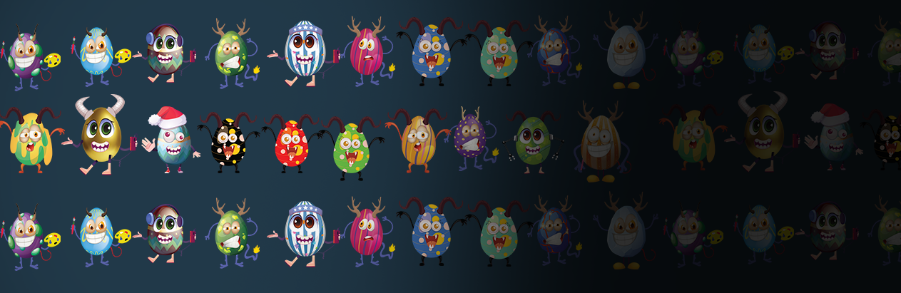

# MONSTER EGGS | CryptinityLab

CryptinityLab 的一个基于 NFT 的项目，6666 个稀有艺术的独特字符。 CryptinityLab 旨在解决 NFT 市场的主要问题，即 Gas 费，这就是为什么我们的第一个项目是关于 Polygon 怪物蛋的持有者 NFT 将能够在游戏中与这些独特的角色一起玩免费游戏将在完成 100% 铸币后启动 .

怪物蛋 | CryptinityLab NFT - 常见问题（FAQ）
▶ 什么是怪物蛋 | 密码实验室？
怪物蛋 | CryptinityLab 是一个 NFT（不可替代令牌）集合。 存储在区块链上的数字艺术品集合。
▶ 怪物蛋有多少 | CryptinityLab 代币存在吗？
总共有 462 个 MONSTER EGGS | CryptinityLab NFT。 目前 307 位业主拥有至少一个 MONSTER EGGS | CryptinityLab NTF 在他们的钱包里。
▶ 怪物蛋有多少 | CryptinityLab 最近卖了？
有 0 个怪物蛋 | CryptinityLab NFT 在过去 30 天内售出。

