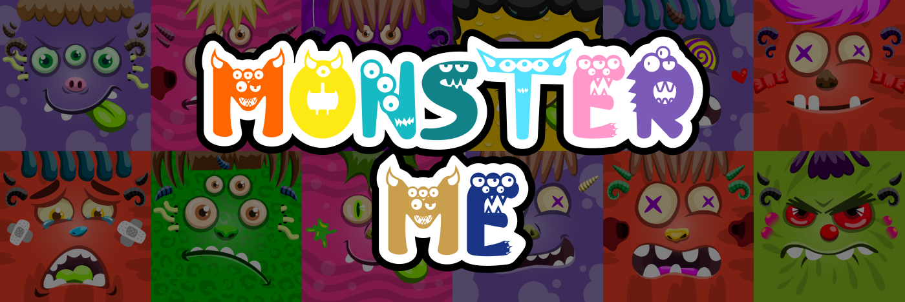

# Monster Me NFT

5000 首铸币免费 | 薄荷后：0.0008（仅限）薄荷在这里 10000 怪物出生并将寻找他们的主人。 立即采纳！ Awrrrr.Reveal 24 小时！

怪物我 NFT NFT - 常见问题（FAQ）
▶ 什么是怪物我NFT？
Monster Me NFT是一个NFT（不可替代令牌）集合。存储在区块链上的数字艺术品的集合。
▶ 有多少 Monster Me NFT 代币存在？
总共有7，777个Monster Me NFT NFT NFT.目前有1，215个所有者在他们的钱包中至少有一个Monster Me NFT NTF。
▶ 最近卖了多少 Monster Me NFT？
在过去的30天内售出了0个Monster Me NFT NFT。
▶ 什么是流行的怪物我NFT替代品？
许多拥有Monster Me NFT NFT的用户也拥有hobittown.wtf，orkstown.wtf官方，cavegoblins.wtf和Money Bags Genesis。

