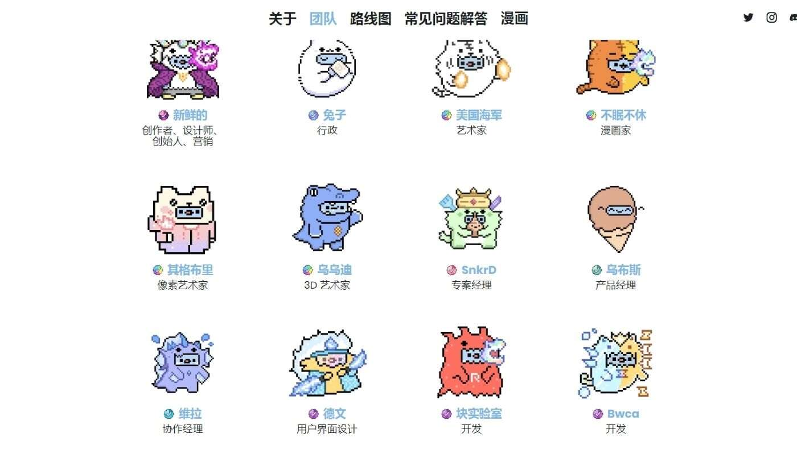

# Monster Suit

MonsterSuitNFTs 是由 5,000 个 MonsterSuit Rues 组成的集合，由手工设计。Crystal Roots LLC 正在开发 Rues 及其 Monster Suits 的世界，因为它们突出了世

界著名插画家 USGMEN 的原创艺术品和 Fresh Moss 的传说。MonsterSuitNFTs 展示了对讲故事和包容性对社区的重要性的信念，因为他们利用他们的 Rues 和

他们的钥匙来解锁两者的巨大而强大的属性，共同导航收藏的方向。

一旦铸币可用，您就可以在OpenSea等平台上的二级市场上购买。

我们的稀有收藏品可以在这里找到。
