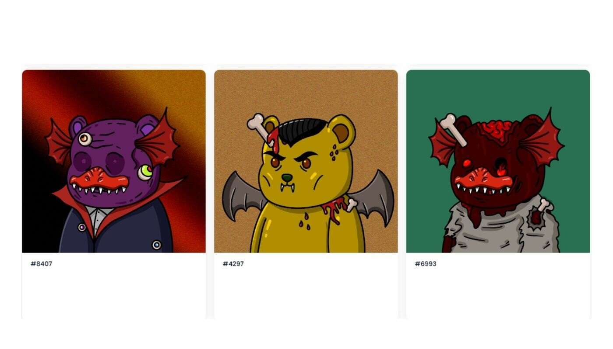

# monsterbeartown.wtf

## 什么是 monsterbeartown.wtf？

Monsterbeartown.wtf 是一个 NFT（非同质代币）集合。存储在区块链上的数字艺术品集合。

## 有多少 monsterbeartown.wtf 代币？

总共有 1,266 个 monsterbeartown.wtf NFT。目前 288 位所有者的钱包中至少有一个 monsterbeartown.wtf NTF。

## 最近卖了多少monsterbeartown.wtf？

过去 30 天内共售出 0 个 monsterbeartown.wtf NFT。

过去 7 天内没有 Monsterbeartown.wtf 出售。总共有 1,266 个 monsterbeartown.wtf NFT。目前 288 位所有者的钱包中至少有一个 monsterbeartown.wtf 

NTF。MonsterBearTown.wtf 是 5000 只熊的集合，它们被放置在区块链上，用于攻击地精镇的地精。即时揭晓！

