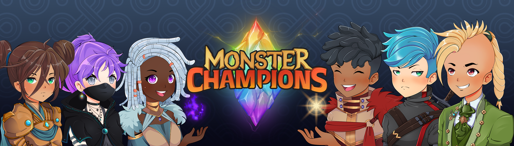

# Monster Champions

在此处查看我们的 Monster Collection，Champions 是 Polygon Network 上基于区块链的 RPG，玩家将在其中作为一个社区进行探索、战斗、交易和学习。 通过主动和闲置选项参与战术回合制战斗，并在此过程中产生收益。

什么是怪物冠军？
Monster Champions 是一个 NFT（不可替代代币）系列。存储在区块链上的数字艺术品集合。
▶ 有多少个 Monster Champions 代币？
总共有 3,220 个 Monster Champions NFT。目前 371 位所有者的钱包中至少有一个 Monster Champions NTF。
▶ 最昂贵的 Monster Champions 销售是什么？
售出的最昂贵的 Monster Champions NFT 是 Champion #2314。它于 2022-06-08（3 个月前）以 617.6 美元的价格售出。
▶ 最近卖出了多少怪物冠军？
过去 30 天内售出了 52 个 Monster Champions NFT。
▶ 怪物冠军需要多少钱？
在过去 30 天里，最便宜的 Monster Champions NFT 销售额低于 44 美元，最高销售额超过 232 美元。 Monster Champions NFT 的中位价格在过去 30 天内为 62 美元。
▶ 什么是流行的 Monster Champions 替代品？
许多拥有 Monster Champions NFT 的用户还拥有 Monster Champions Menagerie、Crypto Raiders MOBS、Crypto Raiders Characters 和 Milan Quadens 的“LOVE”。

