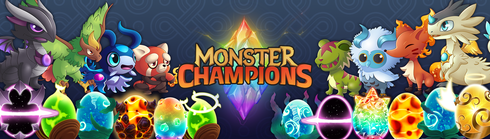

# Monster Champions Menagerie

在此处查看我们的冠军收藏 的世界居住着怪物，无论是朋友还是敌人。 每个怪物在战场上都有独特的目的、技能和优势。随着游戏的进行，你会积累鸡蛋、积分和额外的资源，所有这些都可以用来获得更多的怪物。 出售它们、交易它们、进化它们——选择权在你手中！

什么是怪物冠军动物园？
Monster Champions Menagerie 是一个 NFT（非同质代币）系列。存储在区块链上的数字艺术品集合。
▶ 有多少 Monster Champions Menagerie 代币？
总共有 11,293 个 Monster Champions Menagerie NFT。目前，404 位所有者的钱包中至少有一个 Monster Champions Menagerie NTF。
▶ Monster Champions Menagerie 最昂贵的促销活动是什么？
售出的最昂贵的 Monster Champions Menagerie NFT 是 Infernoso #13。它于 2022 年 6 月 27 日（2 个月前）以 439.1 美元的价格售出。
▶ 最近卖出了多少 Monster Champions Menagerie？
过去 30 天内售出了 137 个 Monster Champions Menagerie NFT。
▶ Monster Champions Menagerie 需要多少钱？
在过去 30 天里，最便宜的 Monster Champions Menagerie NFT 销售额低于 10 美元，最高销售额超过 66 美元。 Monster Champions Menagerie NFT 在过去 30 天内的中位价格为 18 美元。
▶ 什么是流行的 Monster Champions Menagerie 替代品？
许多拥有 Monster Champions Menagerie NFT 的用户还拥有 Monster Champions、Crypto Raiders MOBS、CR Economy Tool 和 Crypto Raiders Characters。

