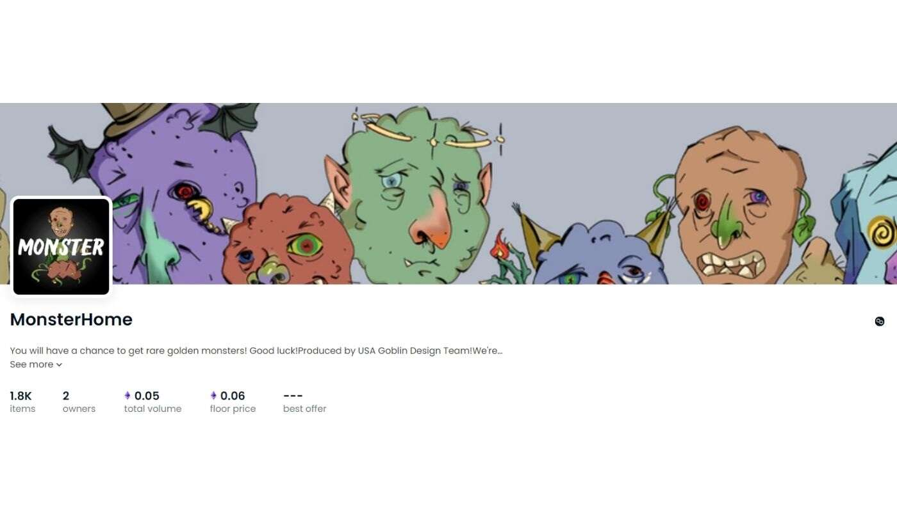

# MonsterHome

您将有机会获得稀有的金色怪物！祝你好运！美国哥布林设计团队出品！我们要发射火箭了！稳坐！

Monster Ape Club | MAC NFT 在过去 7 天内售出 94 次。Monster Ape Club的总销量| MAC 为 10.26 万美元。一只妖猿俱乐部的均价| MAC NFT 为 109.2 美

元。Monster Ape Club有3757人| MAC 所有者，拥有 7,998 个代币的总供应量。Monster Ape Club 是 7,999 个独特生成的 3D Monster Ape 的集合，存储在以

太坊区块链上。艺术作品由 N-Hance Studio 制作。他们的艺术家与暴雪、Riot Games 和其他著名项目合作。
