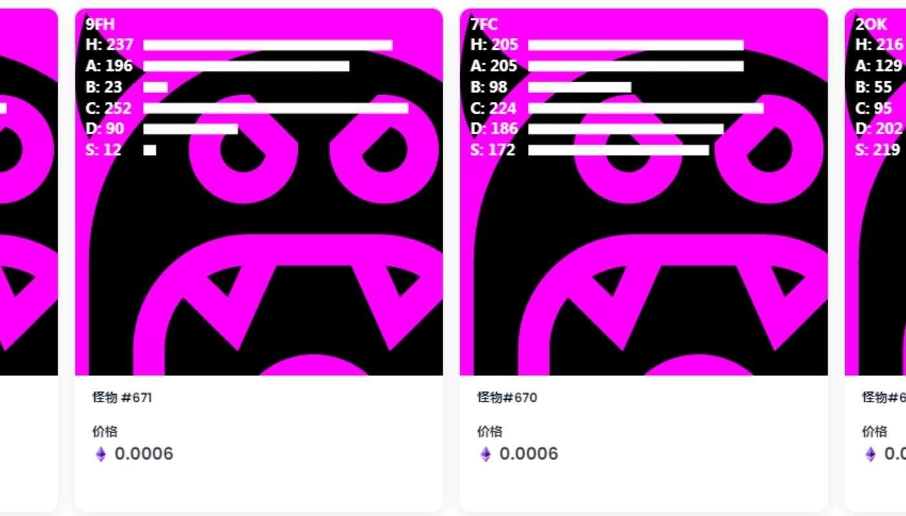

# MonsterLoot

过去 7 天内没有出售 MonsterLetter。第一个基于字母的 NFT 集合，成为第一个拥有字母的人。一个独特的 NFT 集合，包含 26 个 Monster Letter NFT，每个都

基于字母表的不同字母，每个都只有一个副本，并且永远不会重复。

拥有你的信来自不同维度的怪物拥有的音箱。是的，音乐来自他们50个独特的角色创建于 2020 年和 2021 年。最初创建时无意成为 nft，它的性格是独一无二

的，1 / 1如果所有 50 个 nfts 都售出，将进行推销 - 拥有此系列 Nfts 的人将尽早获得所有产品。
