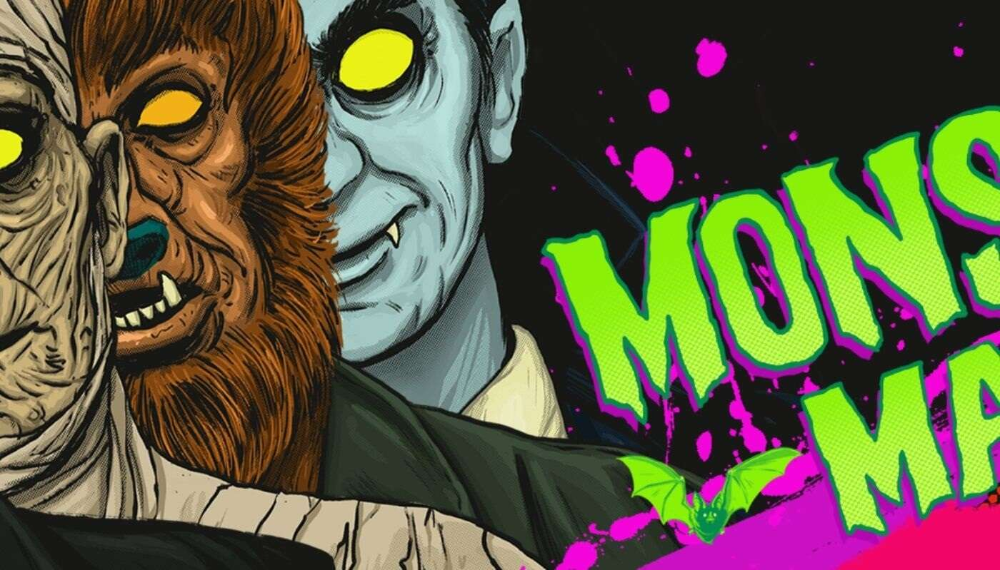

# MonsterMash

Monster Mash 是 10,000 个随机生成的怪物的家园，这些怪物都是手绘的，由 400 多个特征组成，一定会让您兴奋不已！这些独特的数字食尸鬼将以其酷炫的风

格永远萦绕在以太坊区块链上，散发着可怕的激情。

每个怪物都在我们的实验室中经历了终极怪物混搭，随机生成了我们的怪物成员地穴社会，他们拥有从普通到稀有到超级稀有到超稀有的无限数量的外观。这些属

性包括怪物本身、背景、衣服、眼睛、头饰、宠物等等。

这些怪物以 ERC-721 代币的形式存储在以太坊区块链上，并托管在 IPFS 上。你可以用 0.08 ETH 购买你自己的怪物。
