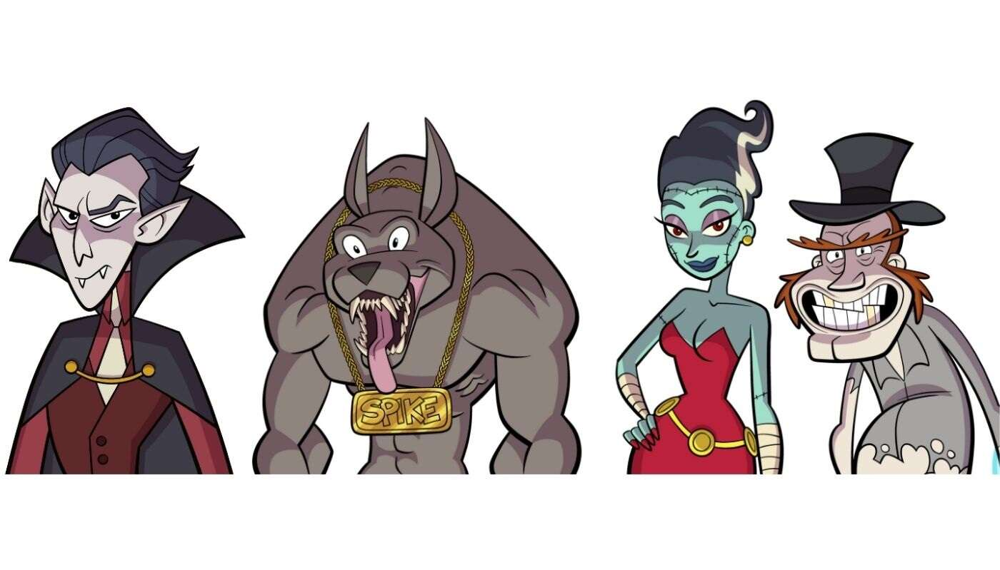

# Monster Rehab

一个素食僵尸、一个无毛狼人和一个对血有非理性恐惧的吸血鬼，联手拯救他们的家园 - 怪物康复中心

**独特的艺术品**

**怪物康复歌曲**

怪物可以与骆驼繁殖，创造出小骆驼怪物

漫画故事情节的投票权贵宾访问幕后

**销售额 1K - 漫画小说的制作开始 - 完成后一本免费的漫画小说**

**销售额 3K - 我们在沙盒中建造了怪物康复医院（仅限怪物）**

**销售额 5K - 我们开始将 IP 开发成电视剧**

在我们自己之外的一个隐藏领域是一个怪物的宇宙！不幸的是，其中一些怪物似乎无法应付他们是谁。 在与恐惧症（一种对血液的非理性恐惧）斗争了一个世纪

之后，十几岁的吸血鬼布拉姆准备放弃生命，但给了怪物康复中心一个机会。

布拉姆在遇到志同道合的怪物后感到宾至如归，并且没有因为他是谁而受到评判。在第一天结束时，布拉姆和他的新朋友发现怪物康复中心将被关闭，因为康复怪

物的成功率太低。

决心暂时不要失去他的新家，布拉姆和朋友们想出了一个计划来拯救康复中心......通过变得更加功能失调。

凭借财富和坚定的爱尔兰保守派，布拉姆从未要求成为吸血鬼，但当诅咒降临在他身上时，他就像冠军一样接受了它。他决心成为最好的吸血鬼，他掌握了他所有

的吸血鬼力量——精神控制、悬浮和变形。

在喂食之前，他是天生的。当布拉姆对血液的恐惧使他生病时，他知道他必须做出改变。希望 Monster Rehab 能有所作为。

总共有 5,365 个 Monster Rehab 1.0 NFT。目前，1,649 位车主的钱包中至少有一个 Monster Rehab 1.0 NTF。售出的最昂贵的 Monster Rehab 1.0 NFT 是 

Monster Rehab #2288 - Blobber。它于 2022-08-10（30 天前）以 14.1 美元的价格售出。过去 30 天内售出了 23 个 Monster Rehab 1.0 NFT。在过去 30 天

里，最便宜的 Monster Rehab 1.0 NFT 销售额低于 12 美元，最高销售额超过 13 美元。Monster Rehab 1.0 NFT 的中位价格在过去 30 天内为 13 美元。
