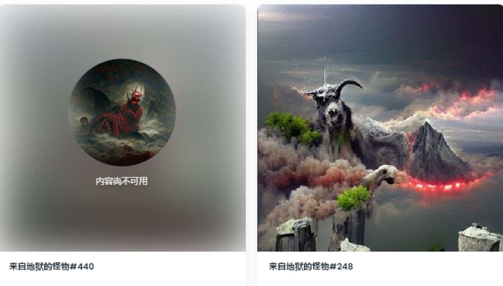

# Monsters From Hell | Official

没有来自地狱的怪物 | 官方在过去 7 天内售出。

666个灵魂坐在地狱的深处。那些为销毁地址做出牺牲的人将获得奖励。

来自地狱的怪物 | Official 是一个 NFT（非同质代币）集合。存储在区块链上的数字艺术品集合。总共有 441 个来自地狱的怪物 | 官方 NFT。目前 295 位拥有者

至少拥有 1 个来自地狱的怪物 | 他们钱包里的官方 NTF。最昂贵的地狱怪物 | 官方出售的 NFT 是 Monsters From Hell #217。它于 2022-06-11（3 个月前）以 

7.3 美元的价格售出。有 1 个来自地狱的怪物 | 过去 30 天内售出的官方 NFT。
