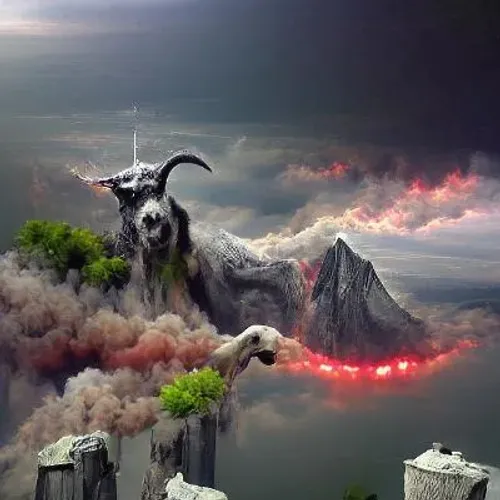

# Monsters From Hell | Official

666个灵魂坐在地狱的深处。 那些为销毁地址做出牺牲的人将获得奖励。

来自地狱的怪物 | 官方 NFT - 常见问题 (FAQ)
▶ 什么是地狱魔物 | 官方的？
来自地狱的怪物 | Official 是一个 NFT（非同质代币）集合。 存储在区块链上的数字艺术品集合。
▶ 有多少来自地狱的怪物 | 官方代币存在吗？
总共有 441 个来自地狱的怪物 | 官方 NFT。 目前 295 位拥有者至少拥有 1 个来自地狱的怪物 | 他们钱包里的官方 NTF。
▶ 什么是地狱中最贵的怪物 | 正式发售？
最昂贵的地狱怪物 | 官方出售的 NFT 是 Monsters From Hell #217。 它于 2022-06-11（3 个月前）以 7.3 美元的价格售出。
▶ 有多少来自地狱的怪物 | 官方最近被卖了？
有 1 个来自地狱的怪物 | 过去 30 天内售出的官方 NFT。

