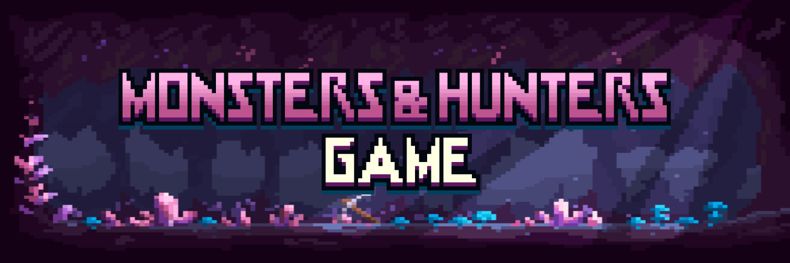

# Monsters & Hunters Game

4,500 个怪物和 500 个猎人在 Ovion 领域争夺领土。您的 NFT 可能会在智能合约中质押时积累一个实用代币（“$CRYSTALS”）。 $CRYSTALS 除了在 Monsters & Hunters 生态系统内没有其他功能，并且不能从 Monsters & Hunters 游戏开发商处购买

Monsters & Hunters Game NFT - 常见问题 (FAQ)
▶ 什么是怪物与猎人游戏？
Monsters & Hunters Game 是一个 NFT（非同质代币）系列。 存储在区块链上的数字艺术品集合。
▶ 有多少 Monsters & Hunters Game 代币？
总共有 4,998 个 Monsters & Hunters Game NFT。 目前，1,182 位所有者的钱包中至少有一个 Monsters & Hunters Game NTF。
▶ 最近卖了多少怪物与猎人游戏？
过去 30 天内共售出 0 个 Monsters & Hunters Game NFT。

