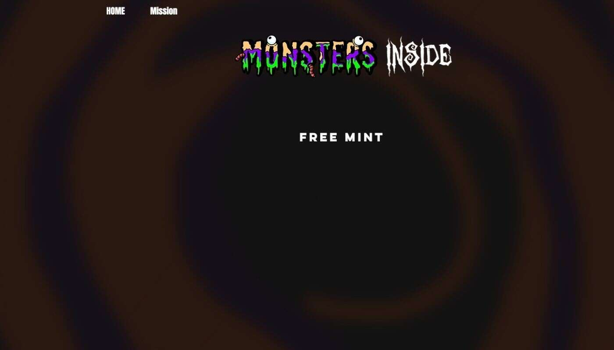

# Monsters Inside NFT Official

6969 个具有黑暗面的 NFT 的集合。一个以艺术为中心、社区驱动的项目，以一种黑暗而神秘的方式产生积极的影响。持有者将拥有对未来活动和商品的独家访问

权。

在一场可破坏的地震中，穆迪怪兽不得不离开他们的星球，到别处寻找庇护所。迷失在时空中，怪物的船被黑洞吸入，将它们送到了虚拟世界。目前迷失在虚拟世

界中，这些怪物需要新的家园，新的父母来照顾他们。怪物数量有限。每个怪物都为您提供一个插槽，让您成为 BIG 的一部分。

我们的目标是建立一个充满激情的社区，发起一场进步运动，并对我们的社会产生影响。我们的价值不仅仅是我们的 NFT。我们的价值基于我们作为一个社区，在

加密货币内外以及我们的社会带来的影响。

我们将与产生奖励的加密平台合作，这些奖励将回馈给社区。

我们相信建立一个强大的社区是在NFT领域取得成功的基础。好的艺术和无缝的合同是伟大的，但拥有一个强大

的社区将最终推动怪物内部项目的长寿。对我们来说，这意味着以社区优先的方式进行领导，不断投资于最有利于社区的方式，并始终保持完全透明。  Web3-我

们都在这里是因为我们相信Web3的力量，以及它弥补差距的能力。主要的重点是建立和连接我们的链上品牌和链外品牌。如果你愿意的话，这是一个从数字到物

理的桥梁。想想现实生活中的事件，高质量的商品，社区聚会，以及建立一个与我们的社区建立联系的强大的品牌。  艺术-怪物内部项目是建立在每个人都有好的

一面和坏的前提上的。该艺术探索了每个人都是从善与恶混合在一起的概念。

