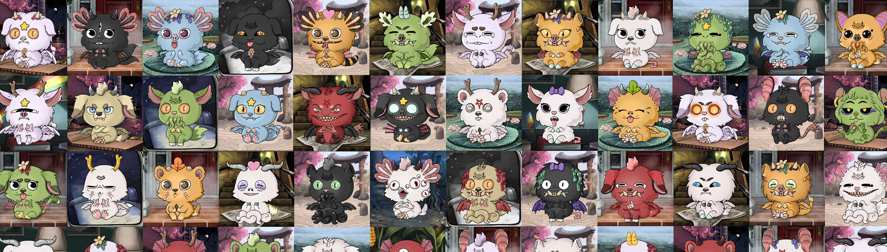

# MonsterShelter

由 5,555 个怪物组成的全动画生成集合，正在开发一款受电子宠物蛋启发的游戏！ 您现在可以加入 Alpha 版本💜 只需获得一个小怪物并开始收集 $TROPHY - 游戏实用程序令牌，发送您的怪物进行狩猎。 未来，我们将添加决斗、市场、秘密任务，当然还有育种！ 越早加入，怪物越强大，收益越多。用爱制造，等待他们的英雄(o ･ ω ･ o)

什么是怪物收容所？
Monster Shelter 是一个 NFT（Non-fungible token）集合。存储在区块链上的数字艺术品集合。
▶ 有多少个 Monster Shelter 代币？
总共有 5,555 个 Monster Shelter NFT。目前，2,255 名所有者的钱包中至少有一个 Monster Shelter NTF。
▶ Monster Shelter 最昂贵的交易是什么？
售出的最昂贵的 Monster Shelter NFT 是 Monster #3626。它于 2022-06-05（3 个月前）以 14.2 美元的价格售出。
▶ 最近卖了多少怪物庇护所？
过去 30 天内售出了 20 个 Monster Shelter NFT。
▶ Monster Shelter 的费用是多少？
在过去 30 天里，最便宜的 Monster Shelter NFT 销售额低于 6 美元，最高销售额超过 13 美元。 Monster Shelter NFT 在过去 30 天内的中位价格为 7 美元。
▶ 有哪些流行的 Monster Shelter 替代品？
许多拥有 Monster Shelter NFT 的用户还拥有 Milan Quadens、spelunking寻宝者、Ghost Frens Collection 和 COVIDPunks 的“LOVE”！

