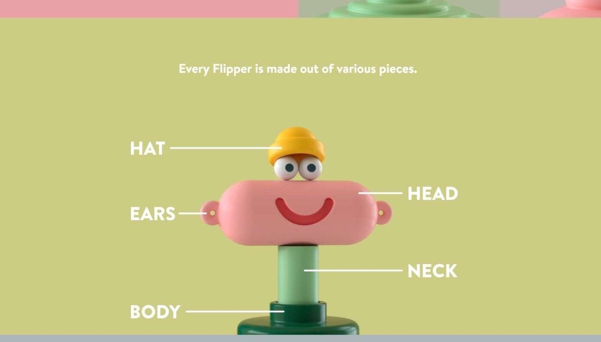

# Mood Flippers

Mood Flippers NFT 在过去 7 天内售出 55 次。Mood Flippers 的总销售额为 5.57 万美元。一份 Mood Flippers NFT 的平均价格为 101.4 美元。有 2,364 名 

Mood Flippers 所有者，总共拥有 5,000 个代币。

5.000 个随机生成的、独特的、动画的、在以太坊区块链上翻转的角色。

每个鳍状肢都是由各种部件制成的。

每件作品都有许多不同的形状和颜色。

每个 Mood Flipper 都带有独特的声音设计。

混合了更稀有的特征，如眼镜、耳环、眼睛颜色、金属件等等。

该系列还包含一些手工制作的 1/1 Mood Flippers。

MoodFlippers 是 MoodVerse 的一部分。由 Lucas Zanotto @lucas_zanotto设计和制作动画。

MoodFlippers 是 Random Character Collective @RNDMCHARACTERS的骄傲成员。
