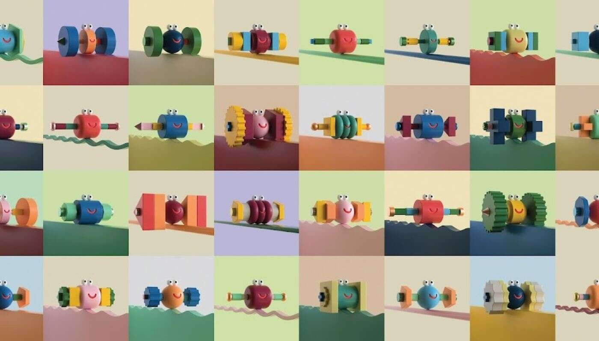

# MoodRollers by Lucas Zanotto

Lucas Zanotto NFT 的 MoodRollers 在过去 7 天内售出 21 次。Lucas Zanotto 的 MoodRollers 总销售额为 2.13 万美元。Lucas Zanotto NFT 的 MoodRollers 的

平均价格为 101.2 美元。Lucas Zanotto 拥有 2,959 个 MoodRollers，总共拥有 5,000 个代币。

5.000 个随机生成的、独特的、动画的、永不停止的以太坊区块链角色。

MoodRollers 是 Lucas Zanotto 和 Random Character Collective 的一个项目。

每个滚轮都有一个称为头部的中心部分、一个第一臂块和第二个臂块以及每侧的最外层螺钉。

每个块都有小，中或大。

材料和颜色各不相同。托盘包括 12 个哑光表面和 12 个金属表面。

通过几乎无穷无尽的组合，所有滚轮都保证是一个独特的、无缝循环的部件。

一些变化是罕见的。

- 200 首金属片
- 200秒金属片
- 150个第一和第二金属片
- 45个全金属滚轮

最稀有的是 5 个完全黑白的版本
