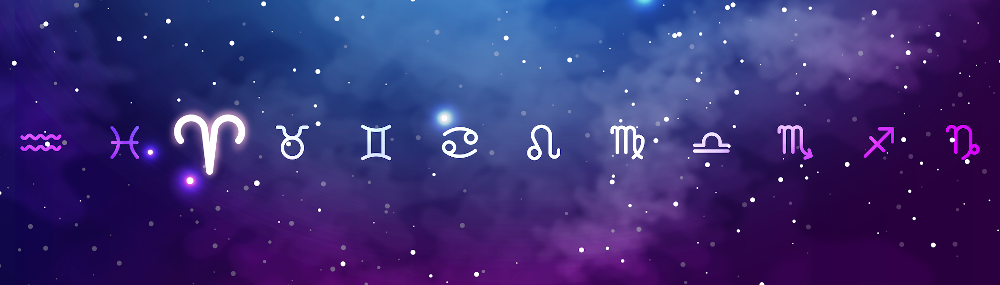

# MoodyAriesUniverse

MoodyAriesUniverse 是 10,000 个独特 NFT 的集合。 白羊座有不同的心情，生活在宇宙中，寻找内心的平静，守护着他的主人。 白羊座希望他的主人幸福，并希望他所有的愿望都能成真。 一旦找到主人，他将永远保护他。 拥有 MoodyAries 被视为身份象征，并自动进入 MoodyZodiacSignUniverse - 家族。

MoodyAriesUniverse NFT - 常见问题（FAQ）
▶ 什么是 MoodyAriesUniverse？
MoodyAriesUniverse 是一个 NFT（非同质代币）集合。 存储在区块链上的数字艺术品集合。
▶ 有多少 MoodyAriesUniverse 代币？
总共有 10,000 个 MoodyAriesUniverse NFT。 目前，12 位所有者的钱包中至少有一个 MoodyAriesUniverse NTF。
▶ MoodyAriesUniverse 最昂贵的销售是什么？
最昂贵的 MoodyAriesUniverse NFT 是 MoodyAries #15。 它于 2022-06-11（3 个月前）以 4.2 美元的价格售出。
▶ 最近卖出了多少 MoodyAriesUniverse？
过去 30 天内售出了 1 个 MoodyAriesUniverse NFT。

