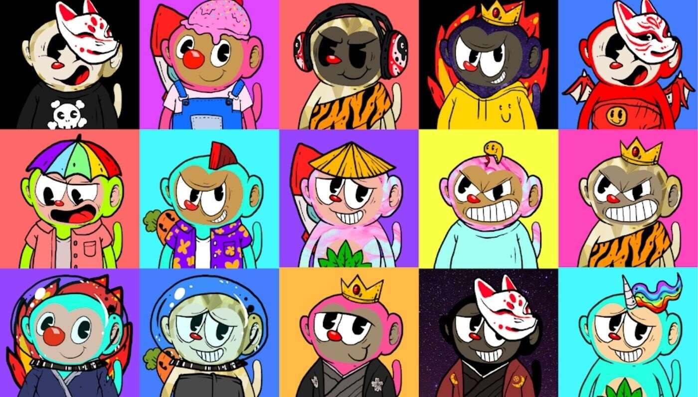

# MOOKEY

在 Polygon 区块链上铸造的 7,777 个 NFT 的新猴子物种集合。每个独特的 Mookey Monkey 都是从 120 个所有手绘元素的组合中随机生成的。每只穆奇猴都有 8 

种不同的特征：脸、头发、皮肤、头饰、衣服、背部和背景颜色。此外，还有一些穆奇猴没有集齐全部8个特质。当然，缺少什么特质——返回

随着恶魔在这片土地上崛起，人们不再相信神。坏人变得更加腐败，无辜者成为恶魔的盛宴。因此，众神选择了这 250 名美猴王，并训练他们变得强大，以结束这

种疯狂。加入我们的冒险，成为登陆者！
