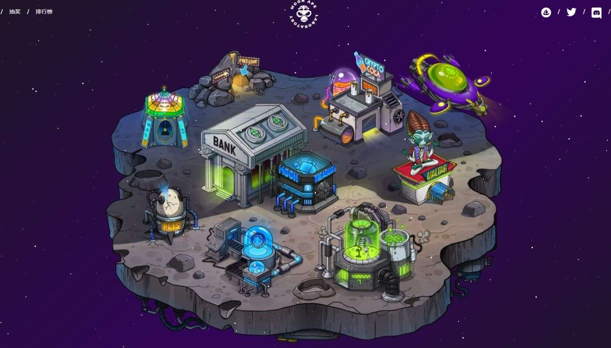

# Moon Ape Cola

通过使用累积的 $MAL 代币购买 Moon Ape Labs 收藏品和特权，您可以收集、繁殖和变异您拥有的 Moon Apes，同时在此过程中收集更多 $MAL。每周日都会

推出新关卡，Ape In 现在就开始吧！

有 5 种类型的 Moon Apes，每一种都会产生不同数量的 $MAL，在质押时每 24 小时（每天）收到一次。质押意味着您的 Moon Ape 将被锁定，直到您取消质押

为止。当您的 Ape 被质押时，它就无法出售。你的奖励取决于你的猿的稀有度——稀有度越高，奖励越高，反之亦然。您将能够在 https://moonapelabs.io/ 的质

押页面上查看您的 Ape 类型和累积奖励。开始建立您的卓越战略，并争取到最高点！

您将能够购买可乐来培育突变体并通过花费您积累的 $MAL 代币进入 Maltar。接下来的路线图步骤可能会影响您的质押奖励。我们希望确保所有社区成员只需通

过玩游戏即可获得所有即将到来的福利和实用程序。爬上我们的第 1 赛季排行榜，抓住机会赢取令人振奋的奖品！

您可以购买前往 Maltar 的门票，并在 Moon Board 排行榜上跟踪您的门票。为此，您必须向售票亭每张票贡献 5000 MAL。 以前，通过支付X

的提款税转换为 ERC20% $MAL 代币，40% 的税收将分配给 Moon Ape Lab Pass 持有者，另外 60% 将每周分配给所有质押的 Moon 国库券。

无法提款到 ERC20 钱包。

加入我们在 Discord 中忠诚而充满激情的社区。跟上新的更新和进一步的公告，并享受与他人分享我们的 P2E 平台的乐趣。
