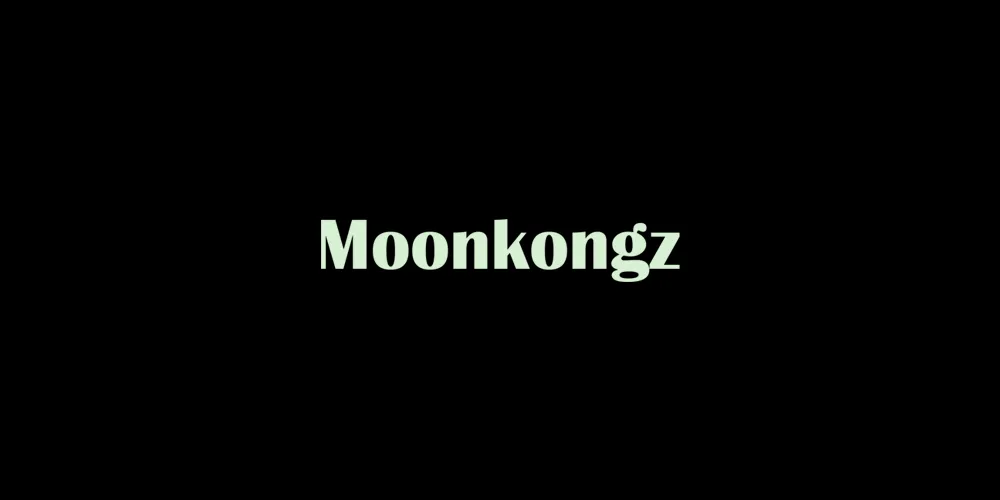

# Moonkongz

喔喔喔喔喔！ 从这里的合同薄荷。 Moonkongz 正在执行前往月球的任务，以寻找更多香蕉。 CC0。

Moon Kongz NFT在过去7天内售出5次。Moon Kongz的总销量为13.5美元。一个Moon Kongz NFT的平均价格为2.7美元。有425个Moon Kongz所有者，拥有1，999个代币的总供应量。

2000 MoonKongz受到两个传奇项目的启发。不隶属于Moonbirds或CyberKongz。用爱为Web3.0社区手绘。

免费薄荷。隐形发射。即时显示。噢噢噢噢噢噢噢

**什么是Moon Kongz？**

Moon Kongz是一个NFT（不可替代令牌）集合。存储在区块链上的数字艺术品的集合。

**有多少Moon Kongz代币存在？**

总共有1，999个Moon Kongz NFT.目前有425个所有者在他们的钱包里至少有一个Moon Kongz NTF。

