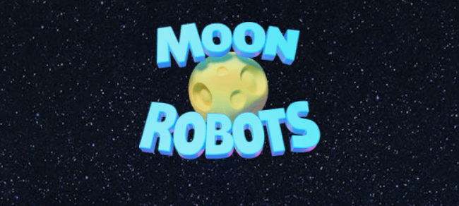

# Moon Robots

Moon Robots是一款即将推出的跨链 NFT DeFi 策略/RPG P2E 游戏，将于 2022 年第二季度在 Harmony 区块链上发布。此次发布所选择的网络快速、安全、高效，将为玩家提供流畅且无需信任的体验。Harmony 拥有最大和最多样化的 GameFi/P2E 生态系统之一，这是一个完美的启动环境。将在 2022 年第三季度扩展到其他网络。

游戏的关键组件是Robot Hero NFT、Moon Land NFT、Item NFT 和 $OIL 代币。该游戏设置为完全具有区块链权威性，并且不会使用服务器或客户端来处理和存储玩家数据。该客户端是基于 Web 的，专为流畅的桌面和移动用户体验而定制。

玩家将使用他们的机器人和土地来赚取 $OIL 代币和物品，这些物品可以在 Harmony 区块链上用任何其他货币进行交易。LP 质押模型将用于代币的初始分配（代币分配阶段），以及在所有 $OIL 代币已发行后，在未来（发行后阶段）可持续地支持代币流动性。

发行后阶段的游戏经济和代币经济学将依赖于对 $OIL 代币的持续需求。需求是通过代币的游戏性实用程序实现的。

