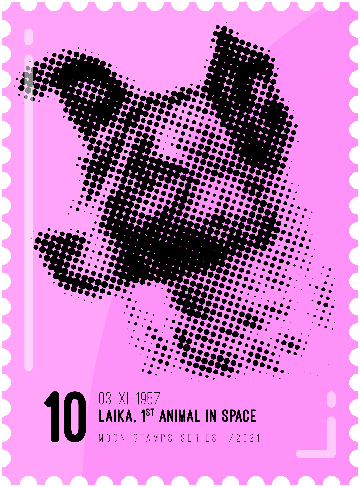

# Moon Stamps NFT

收藏 1,969 枚独家邮票，向征服月球致敬。 3 种颜色、5 种面值、4 种小丑……薄荷后立即揭晓收集完整系列有机会赢得奖品！金色 > 翡翠 > 粉色 :)

月球邮票 NFT NFT - 常见问题（FAQ）
▶ 什么是月球邮票NFT？
Moon Stamps NFT是NFT（不可替代的令牌）集合。存储在区块链上的数字艺术品的集合。
▶ 有多少个月球邮票NFT代币存在？
总共有1，952个月球邮票NFT NFT.目前有186个所有者在他们的钱包里至少有一个月球邮票NFT NTF。
▶ 最近售出了多少枚月球邮票NFT？
在过去的30天内售出了0枚月球邮票NFT NFT。
▶ 什么是流行的月球邮票NFT替代品？
许多拥有Moon Stamps NFT NFT NFTT的用户也拥有Haki NFT - Official，The Genesis RSS3 Avatar NFT，PHUNKIEZ和Cyber Chimpers。

