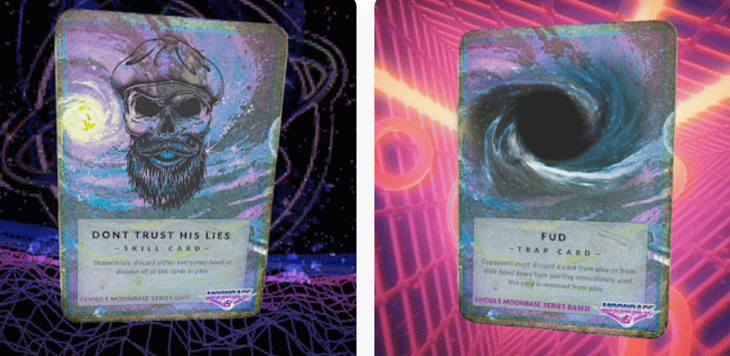

# MoonBase

Moonbase 是由 GHOULS 构建的新 DeFi 原语，旨在鼓励公平启动项目之间的协调、增长和协作。

MoonBase NFT - 常见问题（FAQ）
▶ 什么是月球基地？
MoonBase 是一个 NFT（不可替代代币）集合。 存储在区块链上的数字艺术品集合。
▶ 有多少个 MoonBase 代币？
总共有 5,503 个 MoonBase NFT。 目前 806 位所有者的钱包中至少有一个 MoonBase NTF。
▶ 最近卖出了多少MoonBase？
过去 30 天内售出了 5 个 MoonBase NFT。
▶ 什么是流行的 MoonBase 替代品？
许多拥有 MoonBase NFT 的用户还拥有 Kikillo Magic Places II、Kikillo Mega Mix、Miladykami Flowers 和 STARBOT UNIVERSE (STARDUST)。

