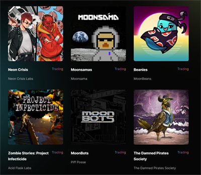

# MoonBeans

Moonbeans NFT平台 — — Moonbeans Galactic Trading Co是一个NFT的世界。Moonbeans是Moonriver上掀起热潮的一站式NFT市场。该平台具有自动奖励BEANS持有者，可定制化选项以及功能齐全的社区DAO。根据最新统计，这是Moonriver上最大的NFT市场，拥有49个上线的收藏品，其中包括Beanies和The Damned Pirates Society。

Moonbeans创始人、CEO兼UX/UI工程师Miami表示：“Moonbeans是一个以社区为重点的艺术主导型市场，我们相信良性竞争能驱动创新。我认为Moonbeans支持ERC-721并即将支持ERC-1155及其强大的激励模型将确保在竞争市场中占有一席之地。”

Moonbeans使用MOVR作为原生Token。这是Moonriver上首个能列出独特且经过量身定制收藏品的市场。Moonbeans致力于成为Moonriver的NFT中心，并将与bean爱好者们共享奖励。

Moonbeans从社区出发，已通过多种方式奖励社区得到验证。BEANS（Moonbeans的主要Token）可以在Solarbeam、Huckleberry、SushiSwap、MoonSwap、Freeriver和Beamswap这6个交易平台swap成MOVR或GLMR。

作为一个聚焦艺术家的平台，Miami解释道收藏品拥有者可以决定将额外0–10%的Galactic Trading Co销售额分配给他们的收藏品。目前对于艺术家来说最大的吸引力是能够获得版权，另外还有一个支持团队能够协助整个过程，不久的将来还会出一个关于铸造的简单操作指南供大家参考。

BEANS持有者可以通过Moonbeam功能齐全的DAO在智能合约决策上投票，但是每个拥有50及以上BEANS的用户也能够获得Moonbeans的份额，使BEANS持有者可以成为项目真正的利益相关者。

Moonbeans的经济模型是独一无二的，每一笔$BEANS交易均会产生交易费。这个可持续性功能使该市场不同于其他市场，专为NFT爱好者所设置并且能够直接受益社区成员。这笔交易费用将被分配用于质押奖励计划、维持流动性和推广NFT收藏品。至少持有50 BEANS意味着该网站每笔交易费用的2%将会返还一定量的BEANS至持有者钱包中。
