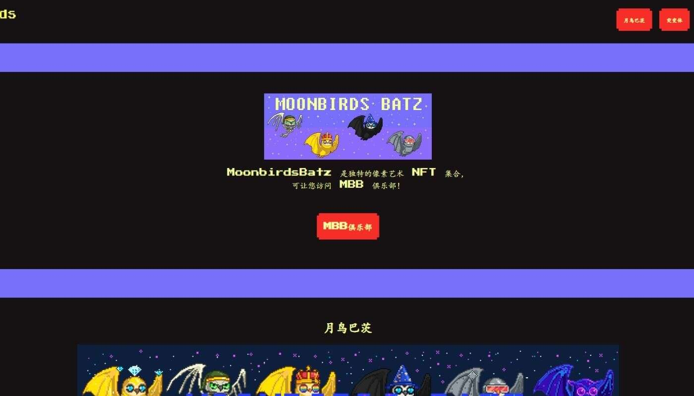

# MoonbirdPunks

MoonbirdPunks NFT 在过去 7 天内售出 6 次。MoonbirdPunks 的总销售额为 68.06 美元。MoonbirdPunks NFT 的平均价格为 11.3 美元。有 1,090 名 

MoonbirdPunks 所有者，总共拥有 2,469 个代币。

官方 OOF 集体 PFP - 2469 MoonbirdPunks！

总共有 2,469 个 MoonbirdPunks NFT。目前，1,090 位车主的钱包中至少有一个 MoonbirdPunks NTF。

售出的最昂贵的 MoonbirdPunks NFT 是 Moonbirdpunks。它于 2022 年 7 月 1 日（2 个月前）以 32.9 美元的价格售出。

过去 30 天内售出了 18 个 MoonbirdPunks NFT。

在过去 30 天里，MoonbirdPunks NFT 最便宜的销售额低于 2 美元，最高销售额超过 13 美元。在过去 30 天内，MoonbirdPunks NFT 的中位价格为 5 美元。
