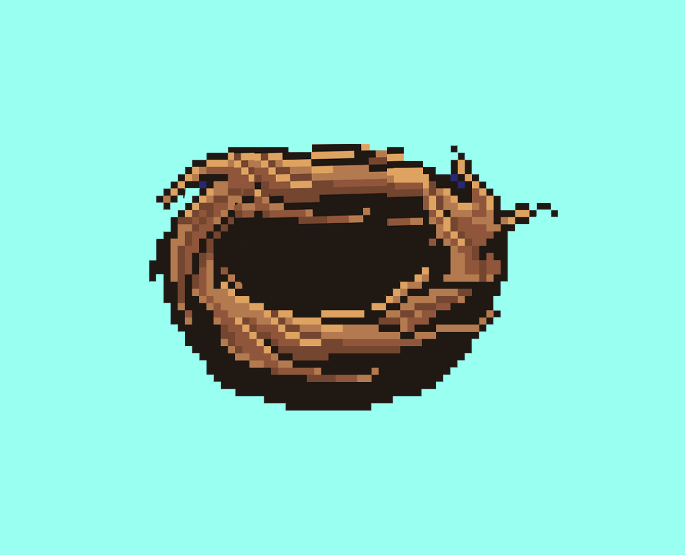

# Moonbirds Nests

2000 个 Nest 的集合，用于匹配支持实用程序的 PFP，这些 PFP 具有丰富多样且独特的稀有性状池。他们称之为嵌套 - 因为，很明显。显然，月亮鸟会进入巢穴。售罄后揭晓。0.002 以太币

什么是月鸟巢？
Moonbirds Nests是NFT（不可替代令牌）集合。存储在区块链上的数字艺术品的集合。
▶ 有多少个月亮鸟巢令牌存在？
总共有1，790个Moonbirds Nests NFT.目前有226个所有者在他们的钱包里至少有一个Moonbirds Nests NTF。
▶ 最近卖了多少月亮鸟巢？
在过去的30天内售出了0个Moonbirds Nests NFT。

