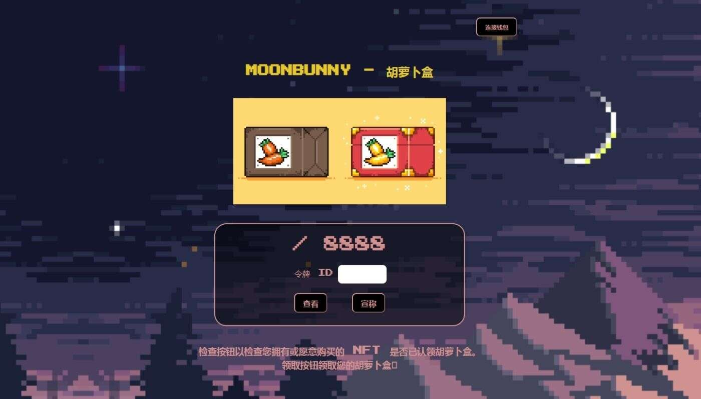

# Moonbunny-NFT

Moonbunny NFT NFT 在过去 7 天内售出 4876 次。Moonbunny NFT 的总销售额为 55.39 万美元。一个 Moonbunny NFT NFT 的平均价格为 11.4 美元。

Moonbunny NFT 拥有者 3,441 名，总供应量为 8,888 个。

Moonbunny！我们在这里🐰 认识 8,888 只兔子 https://linktr.ee/moonbunny_nft

Moonbunny是 8888 只独特生成的兔子的集合。它们都是独一无二的，并且彼此区分开来。每个月兔都有自己的故事。它可能来自我们或拥有它们的人。

每个钱包都可以免费铸造 2 个。之后，您最多可以以 0.005 以太币的额外成本铸造多达 3 个。

如上所述，您可以免费铸币。售罄后，Moonbunnies 将在 Opensea 等二级市场上市。
