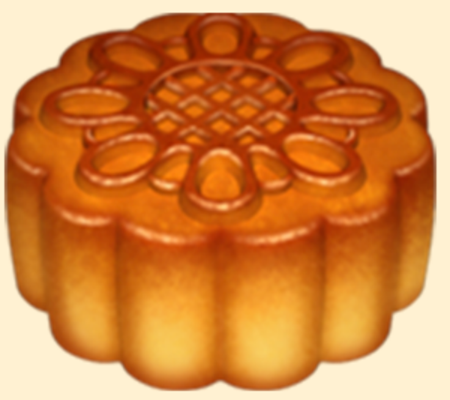

# Mooncake Gift

这个中秋节，送出NFT的礼物。 为您的亲人收集的 1508 个月饼 NFT。 每一份礼物都会让它们变得更美味。Mooncake Gift 是一系列随机生成并存储在链上的月饼。 月饼送的次数越多，越好吃。 故意省略图像以供其他人解释。 随意使用这些月饼。在此处升级您的月饼

薄荷月饼，每一份礼物都让它更美味！
这个中秋节，送出NFT的礼物。 与您的亲人一起庆祝，让他们享用他们的第一个 NFT 月饼。

什么是月饼礼物？
月饼礼物是NFT（不可替代令牌）的集合。存储在区块链上的数字艺术品的集合。
▶ 有多少个月饼礼品代币存在？
总共有1，508个月饼礼品NFT.目前有961个所有者在他们的钱包里至少有一个月饼礼品NTF。
▶ 最近卖了多少个月饼礼物？
在过去的30天内售出了0个月饼礼品NFT。

