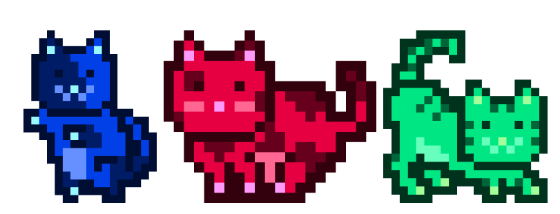

# MoonCatRescue

从月球上救出 MoonCats 并将它们带到以太坊区块链上，在那里它们将安全并过上充实的 MoonCat 生活。我们设计了一艘宇宙飞船，采用最新的垃圾箱技术，最多可容纳 25,600 只 MoonCat。如果您选择加入，那么您将负责扫描并拯救 MoonCats 以确保以太坊区块链的安全！

可能有超过 40 亿个独特的 MoonCat。但是，只能将 25,600 个 MoonCat 添加到合约中。这种采矿与程序生成的结合允许在合约启动之前无法预测的独特体验。救援人员有权选择是否希望特定的 MoonCats 成为合同的一部分。

