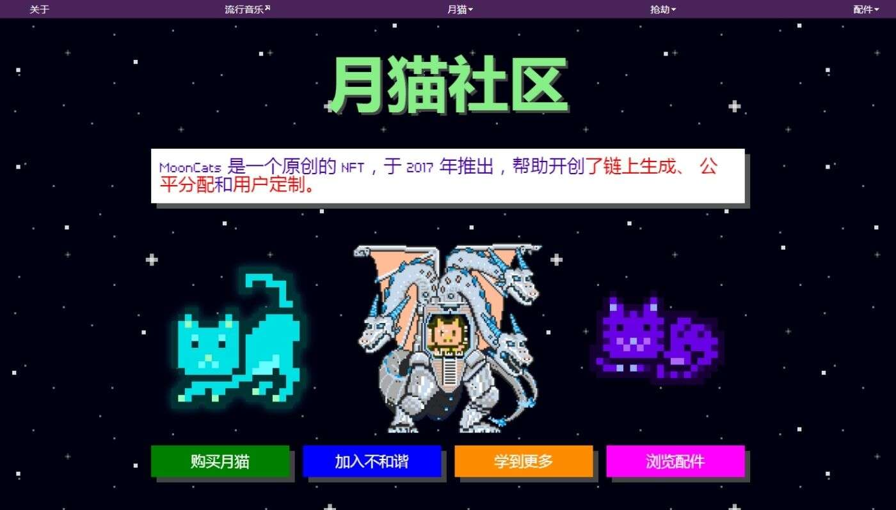

# MoonCats2

MoonCats NFT 在过去 7 天内售出 216 次。MoonCats 的总销售额为 21.96 万美元。一个 MoonCats NFT 的平均价格为 1000 美元。有 5,850 名 MoonCats 所有

者，总共拥有 19,199 个代币。

2017 年 8 月 10 日启动的 MoonCatRescue 疯狂可爱行动取得了成功！获救的 25440 只 MoonCats 正在适应它们作为完全链上可收藏小动物的生活。

复古、生成、公平分配的先驱，MoonCats 也可以在链上MoonCatBoutique进行定制！

所有者拥有其 MoonCat 图像的个人和商业许可。

MoonCats 是一个原创的 NFT，于 2017 年推出，帮助开创了链上生成、 公平分配和用户定制。

起初，月球呕吐物的水坑被认为是由过期的太空金枪鱼和MoonCatPop 的过度放纵造成的。然而，对这些地板彩虹的分析揭示了我们的系统与来自废弃研究项目

的实验像素溶剂相匹配的独特化学特征。

MoonCats 偷偷溜进了 1 层的一个退役实验室，Ethereans 很久以前就在那里试验过固体物质化技术。在那里，我们找到了 Zer0，正在尝试进行改造。我们后来

确定，正是这些工程尝试导致了 MoonCats 一直在采样和反流的冷冻残留物泄漏。

MoonCats 正面临生存危机。他们知道他们在链上，但他们看不到自己在链上。它们存在吗？

一旦我们了解了他们想要完成的任务，一支精锐的专家团队就加入了 Zer0 的猫科动物团队。这是几个月的辛勤工作 - 爪子被撕裂，歌曲在友情中咆哮。然后就完

成了。MoonCats排成一列，一个一个地被完全物化到区块链上。

MoonCats 现在安静地打盹，因为他们知道他们的遗产被永远刻在了以太坊网络的坚实块中。
