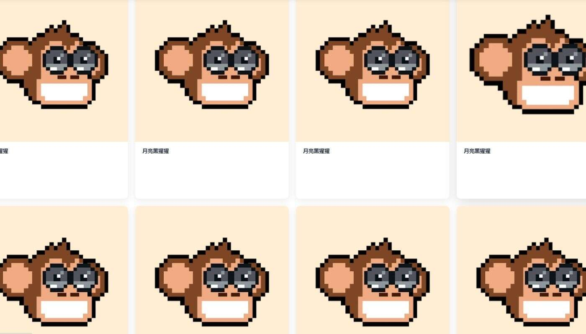

# MoonChimps

过去 7 天没有出售任何Chimpers 。

Chimpers  简单的像素艺术，使Chimpers 的形状和颜色选择非常仔细 这个系列限量版大约 3000 种不同的风格 普通、罕见、稀有、史诗和传奇

总共有 26 个 Chimpaz NFT。目前 3 位所有者的钱包中至少有一个 Chimpaz NTF。

过去 30 天内售出 0 个 Chimpaz NFT。

Chimpers NFT 在过去 7 天内售出 157 次。Chimpers 的总销售额为 $320.07k。一个 Chimpers NFT 的平均价格为 2000 美元。共有 886 名 Chimpers 所有者，

总共拥有 5,555 个代币。

真正的所有者数为 2,600。4,228/5,555 Chimpers 被质押在 DOJO https://opensea.io/collection/chimperstraining

Chimpers 是由@TimpersHD 创建的 5,555 个生成 NFT 像素字符的集合。Chimpers 是您在 Chimpverse 中的数字身份，也是您冒险的通行证。！Chimpers 
