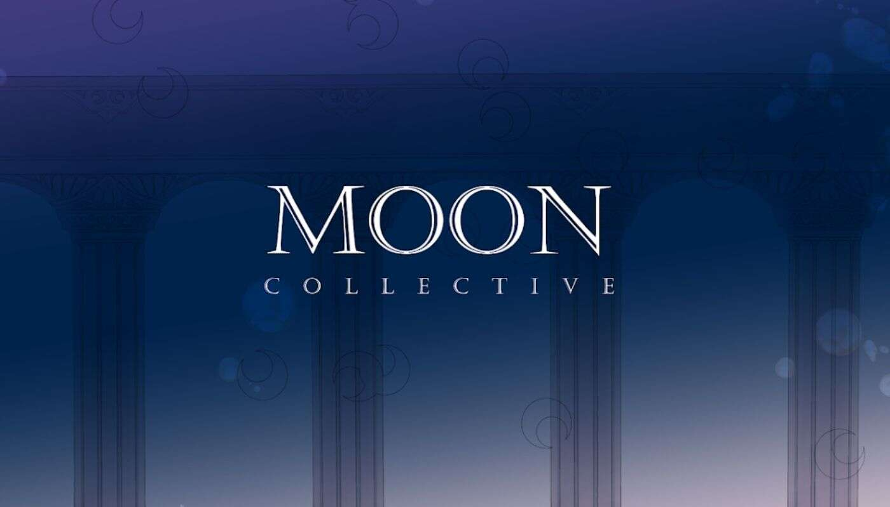

# MoonCollective Official

MoonCollective 官方 NFT 在过去 7 天内售出 1 次。MoonCollective Official 的总销售额为 2.2 美元。一份 MoonCollective 官方 NFT 的平均价格为 2.2 美元。共

有 1,343 名 MoonCollective 官方所有者，总共拥有 1,999 个代币。

我们是一个信息中心，反映了独家蓝筹项目内部的对话，将其封闭的、紧密的阿尔法鲸群中的信息分发给 MOON Collective 社区。

目前反映到我们的持有人：

无聊猿游艇俱乐部 Azuki Anonymice Moonbirds Coolcats Habibiz Karafuru Kaiju Zombieclub MVHQ

我们是一个信息中心，反映了独家蓝筹项目内部的对话，以将其封闭的、紧密的阿尔法鲸群中的信息分发给 MOON Collective 社区。目前我们向我们的持有者反

映：Bored Ape Yacht Club、Azuki、Anonymice、Moonbirds、Coolcats、Habibiz、Karafuru、Kaiju、Zombieclub、MVHQ

蓝筹股是拥有 NFT 的社区，其价格远高于散户投资者可用的 NFT。例如，BAYC 目前位于 100+ ETH 的楼层，并由 web3 世界中一些最富有和最杰出的影响者持

有。富人因这些大门而变得更富有。

我们反映的这些社区的成员总数超过 200 ETH 随着 BAYC 土地等的成功，社区变得更加强大并产生了更大的影响力。

Moon Collective 通行证将以低得多的薄荷价格提供，以便真正努力保持领先地位的 NFT 社区成员将获得一些可用的最独家信息的低切入点。
