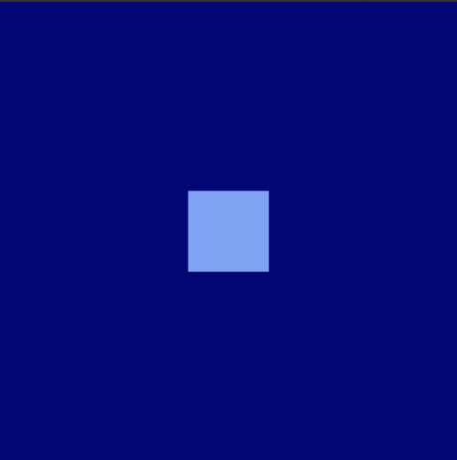

# Moondots

这些是Moondots。 其中有 5555 个。 就这些。

下一步是什么？
即时显示。
我们是否去月球🚀。
资金将流向何方？
100%的收入将用于资助我未来的项目。

月点 NFT - 常见问题（FAQ）
▶ 什么是月点？
Moondots是一个NFT（不可替代的令牌）集合。存储在区块链上的数字艺术品的集合。
▶ 有多少个月点代币存在？
总共有130个Moondots NFT.目前有19个所有者在他们的钱包里至少有一个Moondots NTF。
▶ 最近卖出了多少个月点？
在过去的30天内售出了0个Moondots NFT。

