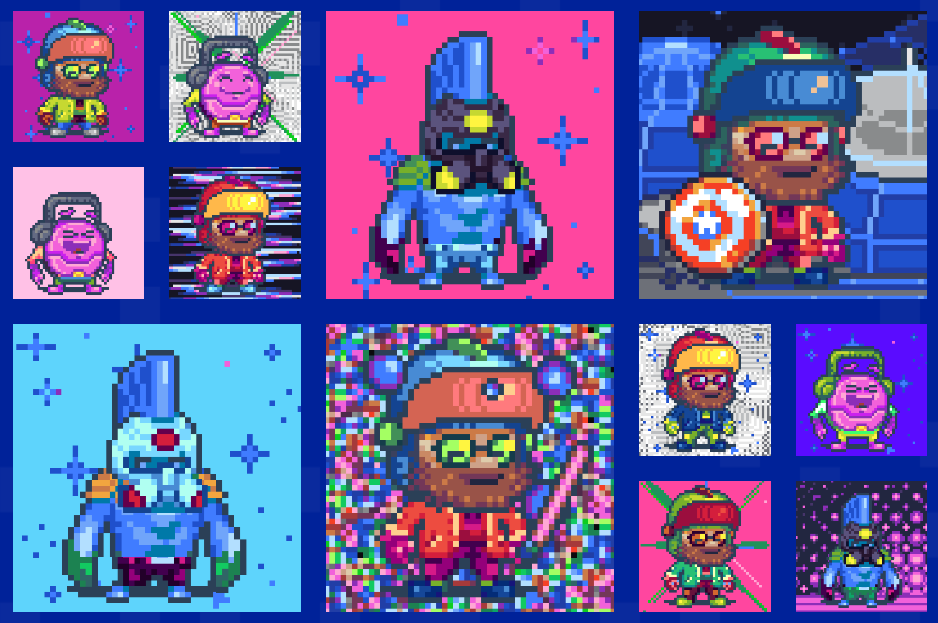

# Moonie NFT

在 Moonieverse 中无处不在的 $MNY 代币。它的需求是由游戏体验和有吸引力的奖品驱动的。Token，以独特的方式将游戏内的 NFT 与 DeFi 机制连接起来。

进入Moonieverse，这是一个交互式生态系统，其中每个 NFT 都是100% 可用的。Moonieverse是一个广阔而神秘的景观，充满了引人入胜的探索机会。Moonieverse的居民，被称为Moonies，充满热情和兴奋地迎接机遇。Moonies开始他们的旅程，去月球，在你最喜欢的加密货币之间进行价格竞赛以到达那里。

第一场比赛将在 BTC、ETH 和 DOGE 之间进行。未来的竞赛将涉及诱人的 DeFi 竞赛，例如“ETH Killer Race”和“The Exchange Coins Race”。使用研究实验室在帮助推进Moonie火箭技术的同时获得收益和奖励。释放您的Moonie狂热的竞争动力，通过升级您的 Moonie 赢得丰厚奖励。

