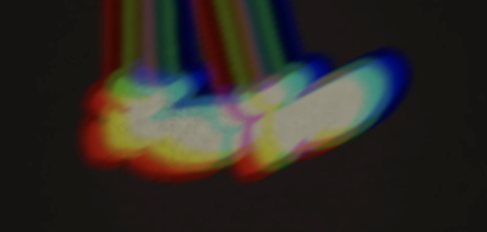

# MoonlightLoveAffair

▶ 什么是 MoonlightLoveAffair？
MoonlightLoveAffair 是一个 NFT（非同质代币）集合。存储在区块链上的数字艺术品集合。
▶ 有多少 MoonlightLoveAffair 代币？
总共有 452 个 MoonlightLoveAffair NFT。目前，135 位所有者的钱包中至少有一个 MoonlightLoveAffair NTF。
▶ 最昂贵的 MoonlightLoveAffair 促销活动是什么？
售出的最昂贵的 MoonlightLoveAffair NFT 是 #0345 — Moonlight Love Affair。它于 2022-07-03（大约 2 个月前）以 329.3 美元的价格售出。
▶ 最近卖了多少MoonlightLoveAffair？
过去 30 天内售出了 4 个 MoonlightLoveAffair NFT。
▶ 什么是流行的 MoonlightLoveAffair 替代品？
许多拥有 MoonlightLoveAffair NFT 的用户还拥有 Morphys、 Original Cryptonauts、 Crypto Whales NFTs Official和 Roman Gutikov x Editions。

