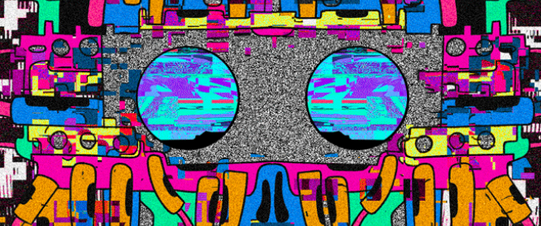

# Moon Machines

**月球机器统计**
创建于 3 个月前
1 代币供应
10% 费用
过去 7 天没有售出月球机。

**Moon Machines NFT - 常见问题（FAQ）**
▶ 什么是月球机器？
Moon Machines 是一个 NFT（非同质代币）集合。存储在区块链上的数字艺术品集合。
▶ 有多少 Moon Machines 代币？
总共有 1 个 Moon Machines NFT。目前 3 位所有者的钱包中至少有一个 Moon Machines NTF。
▶ 最昂贵的 Moon Machines 销售是什么？
售出的最昂贵的 Moon Machines NFT 是 MM1-Horned。它于 2022-06-11（3 个月前）以 120.9 美元的价格售出。
▶ 最近卖出了多少台月球机？
过去 30 天内售出了 1 个 Moon Machines NFT。

