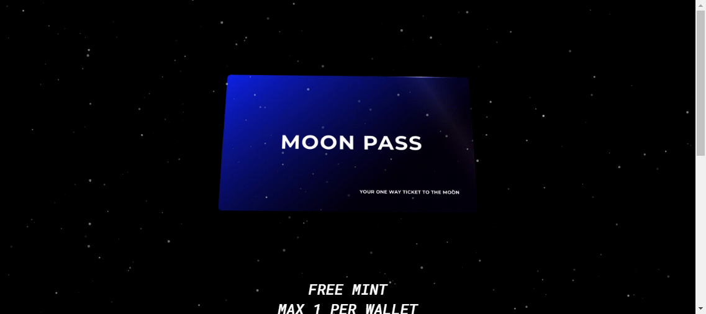

# MoonPass_

**免费薄荷**
每个钱包最多 1 个

复活以恢复烧毁的 NFT
目前花费 0.1 ETH

任何低于 0.1 ETH 的 NFTS 或在 OPENSEA 以外的市场上上市的任何 NFTS 都将被自动销毁

**MoonPass_NFT - 常见问题（FAQ）**
▶ 什么是 MoonPass_？
MoonPass_ 是一个 NFT（非同质代币）集合。存储在区块链上的数字艺术品集合。
▶ 有多少个 MoonPass_ 代币？
总共有 92 个 MoonPass_NFT。目前 92 位所有者的钱包中至少有一个 MoonPass_NTF。
▶ 最昂贵的 MoonPass_ 销售是什么？
售出的最昂贵的 MoonPass_NFT 是 MoonPass。它于 2022-06-12（3 个月前）以 75.8 美元的价格售出。
▶ 最近卖出了多少MoonPass_？
过去 30 天内售出了 3 个 MoonPass_ NFT。

