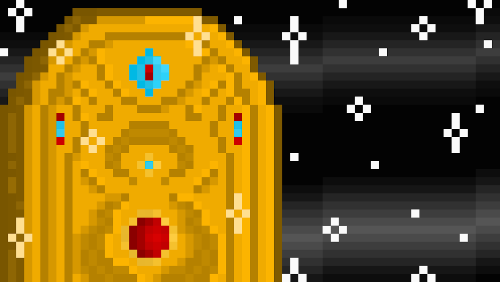

# MoonRacoons

▶ 什么是 MoonRacoons？
MoonRacoons 是一个 NFT（非同质代币）集合。存储在区块链上的数字艺术品集合。
▶ 有多少个 MoonRacoons 代币？
总共有 2,000 个 MoonRacoons NFT。目前，602 位所有者的钱包中至少有一个 MoonRacoons NTF。
▶ 最昂贵的 MoonRacoons 销售是什么？
售出的最昂贵的 MoonRacoons NFT 是 #1306。它于 2022 年 6 月 28 日（2 个月前）以 301.9 美元的价格售出。
▶ 最近卖出了多少个 MoonRacoons？
过去 30 天内售出了 667 个 MoonRacoons NFT。
▶ MoonRacoons 的价格是多少？
在过去 30 天里，MoonRacoons NFT 最便宜的销售额低于 10 美元，最高销售额超过 38 美元。MoonRacoons NFT 在过去 30 天内的中位价格为 20 美元。
▶ 什么是流行的 MoonRacoons 替代品？
许多拥有 MoonRacoons NFT 的用户还拥有 Moonswingers、 Perennials、 Obits Official和 Moongorillas Official。

