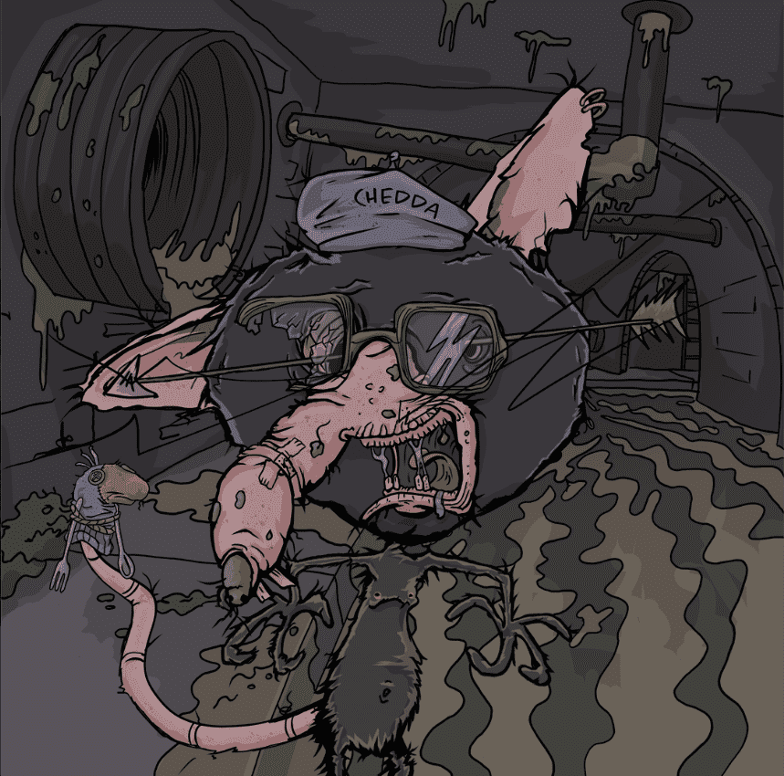
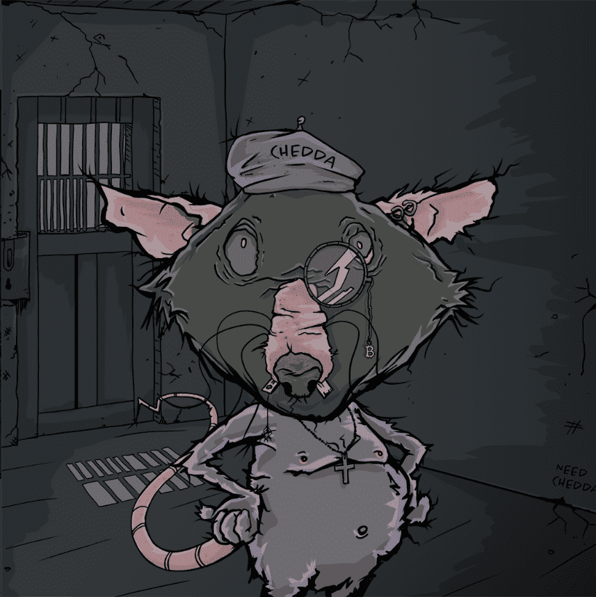

# MoonRatzWTF

- **5k 收藏**
- **+100 特质**
- **3x 1/1**

我们只是一些试图登月并得到切达干酪的拉茨。从OpenSea获得一只老鼠，加入革命，开始赚取被动收入！

**MoonRatz 不仅仅是涂料艺术。**

查看我们的老鼠地图，了解更多关于我们整个生态系统的信息，这些生态系统为我们的持有者提供了实用程序和福利。

**RatTrap 是可交易的代币**

MoonRatz 生态系统的一部分，总供应量为 1000 万，交易税为 10%，DAO 为 3%，营销钱包为 5%，流动性为 2%。

